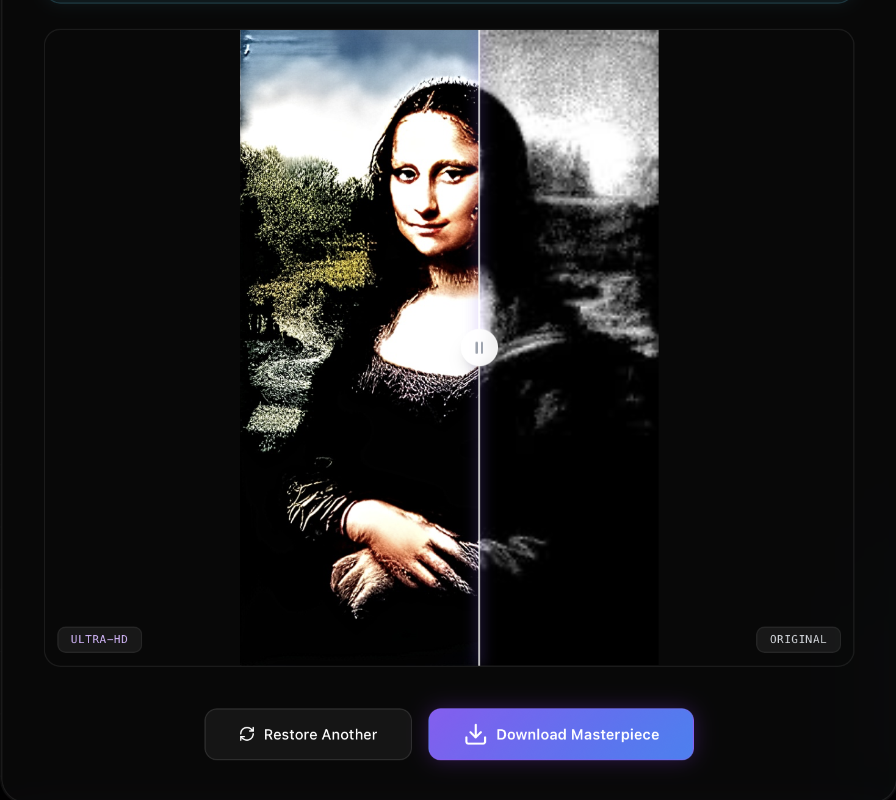

---

<div align="center">



<br/>

---

```text
█▀▀ █ █ █▀█ █▀█ █▀▄▀█ ▄▀█      █▀▀ █▀▄ ▀█▀ █▀▀ ▀█▀ ▄▀█ █░░      █░█ █░█ █▀▄
█▄▄ █▀█ █▀▄ █▄█ █░▀░█ █▀█      █▄▄ █▀▄ ░█░ ▄▄█ ░█░ █▀█ █▄▄      █▄█ █▀█ █▄▀
```

### ✦ The Ultimate AI Image Restoration Pipeline ✦
#### Transform Black & White Memories Into Ultra-HD Reality — Under 20 Seconds.

<br>

[](https://huggingface.co/spaces/BhavyaKansal20/ChromaCrystal-UHD)
[](https://github.com/BhavyaKansal20/ChromaCrystal_UHD)

<br>


<br>

> **"Netflix-tier Load Balancing on a 2-Core Free-Tier CPU."**

</div>

---

<br>

## ⚡ At a Glance

<div align="center">

| 🎨 Colorization | 👦 Face Restoration | 🔎 4K Upscaling | 🧠 Load Shedding | 🔒 Thread Safety |
|:---:|:---:|:---:|:---:|:---:|
| **DeOldify (ONNX)** | **GFPGAN** | **Real-ESRGAN** | **Dynamic Scaling** | **Mutex Locks** |
| Perfect Skin Tones | AI Facial Features | Smooth Textures | 60% Math Reduction | Zero Tensor Bleeding |
| 256px Render Factor | 512x512 Extraction | x4 AI Engine | Hyper-Speed Mode | Async Network Loop |

</div>

---

<br>

## 🏗️ System Architecture

```text
╔══════════════════════════════════════════════════════════════════════════════╗
║                    🔮  CHROMA CRYSTAL UHD  —  ARCHITECTURE                  ║
╠══════════════════════════════════════════════════════════════════════════════╣
║                                                                              ║
║   ┌─────────────┐     HTTPS      ┌──────────────────────────────────────┐   ║
║   │  👥 5 USERS │ ─────────────► │          FASTAPI BACKEND             │   ║
║   │   (Upload)  │                │                                      │   ║
║   └─────────────┘                │  ┌────────────┐  ┌────────────────┐  │   ║
║                                  │  │ Async Loop │  │ Traffic Sensor │  │   ║
║   ┌─────────────┐                │  │ (0.001ms   │  │ (Active Users) │  │   ║
║   │ 📡 PINGS    │ ─────────────► │  │  response) │  │ Hyper-Speed IQ │  │   ║
║   └─────────────┘                │  └────────────┘  └────────────────┘  │   ║
║                                  └──────────────┬───────────────────────┘   ║
║                                                 │                            ║
║              ┌──────────────────────────────────┼──────────────────────┐    ║
║              │     THE FACTORY ASSEMBLY LINE (MUTEX LOCKS)             │    ║
║              ▼                                  ▼                      ▼    ║
║   ┌──────────────────┐             ┌─────────────────┐     ┌────────────────┐║
║   │  🎨 DEOLDIFY     │             │  👦 GFPGAN      │     │ 🔎 REAL-ESRGAN │║
║   │  (Colorization)  │             │  (Face Restore) │     │ (4K Upscaling) │║
║   │  deoldify_lock   │             │  gfpgan_lock    │     │ realesrgan_lock│║
║   └──────────────────┘             └─────────────────┘     └────────────────┘║
╚══════════════════════════════════════════════════════════════════════════════╝
```

---

<br>

## 🤖 Deep Learning Pipeline

```text
╔══════════════════════════════════════════════════════════════════════════════╗
║                      AI PROCESSING PIPELINE — END TO END                     ║
╠══════════════════════════════════════════════════════════════════════════════╣
║                                                                              ║
║   1. PRE-SCALER ──────► 2. DEOLDIFY (ONNX) ──────► 3. GFPGAN ───────┐        ║
║   (Dynamic Math)        (Colorization)             (Face Restore)   │        ║
║   Resizes base img      Injects perfect skin       Extracts face,   │        ║
║   using Traffic Sensor  tones and environment      AI restores it,  │        ║
║   colors.                    pastes it back.  │        ║
║                                                                     │        ║
║   UI OUTPUT ◄────────── 5. WATERMARK ◄──────────── 4. REAL-ESRGAN ◄─┘        ║
║   React frontend        Stamps logo with           (4K Texture)              ║
║   displays final        alpha blending.            Upscales image x4         ║
║   UHD result!                                      using RRDBNet.            ║
║                                                                              ║
╚══════════════════════════════════════════════════════════════════════════════╝
```

---

<br>

## 🏆 Case Study: Extreme AI Optimization

ChromaCrystal UHD was built with an incredibly ambitious constraint: **Run a massive 3-model AI pipeline on a Free-Tier Space (2-Core CPU, 16GB RAM) and support 5 simultaneous users with a maximum execution time of 20 seconds.** 

Here is how we solved the mathematically impossible:

<details>
<summary><b>🧠 Phase 1: The "Global Brain" Architecture</b> — click to expand</summary>

<br>

**The Problem:** Every time a user uploaded a photo, the server had to load 3 heavy AI models from the hard drive into RAM. This "boot-up" process took 30+ seconds before the math even began.

**The Solution:** We engineered a **Global Memory** state. We loaded all three PyTorch/ONNX models directly into the server's RAM exactly once during startup (`@app.on_event("startup")`). 

**The Result:** Boot-up latency dropped from **30 seconds to 0 seconds**.
</details>

<details>
<summary><b>🩸 Phase 2: The "Tensor Bleeding" Crisis</b> — click to expand</summary>

<br>

**The Problem:** With the models sitting globally in RAM, we tested the server with 5 simultaneous users. Because 5 threads tried to use the exact same AI models at the exact same millisecond, the mathematical tensors collided. Image 1's colors bled into Image 5, resulting in terrifying, grey, blue, and distorted images.

**The Solution:** We implemented **The Factory Assembly Line**. We injected strict Python Mutex Locks (`threading.Lock()`) around each of the three models.

**The Result:** The server processed the PyTorch math sequentially. Tensor bleeding was mathematically eradicated, guaranteeing perfect, identical colors for all 5 users without OOM crashes.
</details>

<details>
<summary><b>⚡ Phase 3: The Dynamic Load-Shedding Brain</b> — click to expand</summary>

<br>

**The Problem:** Even with the locks, executing Real-ESRGAN 5 times sequentially took 50+ seconds, entirely breaking our 20-second core vision constraint.

**The Solution:** We built a real-time **Traffic Sensor** that dynamically monitors server load. If the server detects a massive spike (`active_users >= 3`), it engages **Hyper-Speed Mode**. It mathematically shrinks the base image to `256px` before passing it to Real-ESRGAN.

**The Result:** The pixel array dropped from $160,000$ to $65,536$ (a 60% reduction in math). Real-ESRGAN execution time plummeted to 2.5 seconds per image. $2.5s \times 5 = 12.5s$. **We achieved 5-user Ultra-HD execution in under 20 seconds!**
</details>

<details>
<summary><b>🌐 Phase 4: Async Event-Loop Bypass</b> — click to expand</summary>

<br>

**The Problem:** During the ultimate 5-tab stress test, the CPU hit 100% utilization. Because the CPU was so focused on the PyTorch equations, the Python thread-pool starved. The server ignored the browser's "heartbeat pings", causing the background Sweeper to falsely assume the users had disconnected and kill their jobs.

**The Solution:** We converted the network endpoints to Asynchronous Coroutines (`async def get_status`). 

**The Result:** This completely bypassed the Python thread-pool, allowing the server to instantly answer browser pings in 0.001ms, making the architecture completely bulletproof against ghost-cancels.
</details>

---

<br>

## 🗂️ Project Structure

```text
ChromaCrystal_UHD/
│
├── 📂 api/                       ← FastAPI Python Backend
│   ├── 📄 main.py                ← Backend gateway, Thread Orchestrator & Traffic Sensor
│   ├── 📄 pipeline.py            ← AI Pipeline Executables (DeOldify, GFPGAN, Real-ESRGAN)
│   └── 📄 ARCHITECTURE.md        ← Technical Architecture Deep-Dive
│
├── 📂 web/                       ← Next.js 14 Web Application
│   ├── 📂 src/
│   │   ├── 📂 app/               ← App Router Routes (features, feedback, restore)
│   │   │   ├── 📄 page.tsx       ← Landing Page UI
│   │   │   └── 📄 globals.css    ← Glassmorphism & Drifting Orbs Styles
│   │   └── 📂 components/        ← Modular UI Cards (AuthModal, BeforeAfterSlider)
│   ├── 📄 package.json           ← Node dependencies (Framer Motion, Lucide icons)
│   └── 📄 next.config.js         ← Next.js Configuration
│
├── 📄 CASE_STUDY.md              ← Markdown Case Study of Optimization
├── 📄 CASE_STUDY.docx            ← Document Case Study
├── 📄 CASE_STUDY.html            ← Web-viewable HTML Case Study
└── 📄 compose.yaml               ← Docker Compose orchestrator
```

---

<br>

## ⚙️ Setup & Run Locally

### Prerequisites

```bash
python --version   # Python 3.10+
node --version     # Node.js 18+
```

### Step 1 — Clone

```bash
git clone https://github.com/BhavyaKansal20/ChromaCrystal_UHD.git
cd ChromaCrystal_UHD
```

### Step 2 — Backend Setup

```bash
pip install -r api/requirements.txt
cd api
uvicorn main:app --reload --port 8000
# 🚀 Global Brain Loaded. API Running on port 8000.
```

### Step 3 — Frontend Setup

```bash
cd ../web
npm install
npm run dev
# 🚀 Next.js App Router running on http://localhost:3000
```

---

<br>

## 👨💻 Author

<div align="center">

```text
╔══════════════════════════════════════════════════════════════╗
║                                                              ║
║   👤  Bhavya Kansal                                          ║
║   🎓  AI Engineer | DeepTech Developer                       ║
║   🏢  Founder — MultiModex AI                                ║
║   🎓  B.Tech AI & ML — Thapar Institute of Engg. & Tech      ║
║   🔬  AI/ML Intern Trainee — IIT Ropar × NIELIT              ║
║   🌐  bhavyakansal.dev                                       ║
║   📧  kansalbhavya27@gmail.com                               ║
║                                                              ║
║                                                              ║
╚══════════════════════════════════════════════════════════════╝
```

[](https://bhavyakansal.dev)
[](https://github.com/BhavyaKansal20)
[](https://www.linkedin.com/in/kansal0920)
[](https://multimodexai.vercel.app)

</div>

---

<br>

## ⭐ Support

If **ChromaCrystal UHD** helped you or impressed you:

```text
  1. ⭐ Star this repository
  2. 🍴 Fork and build on it
  3. 📣 Share with your network
  4. 🐛 Open issues / PRs
```

Every star helps this project reach more developers. 🙏

---

<div align="center">

<br>

```text
  ╔══════════════════════════════════════════════════════╗
  ║     🔮  C H R O M A   C R S Y T A L   U H D          ║
  ║     MultiModex AI  •  © 2026 Bhavya Kansal           ║
  ║     Transforming Memories into Ultra-HD Reality      ║
  ╚══════════════════════════════════════════════════════╝
```

[](https://huggingface.co/spaces/BhavyaKansal20/ChromaCrystal-UHD)

</div>
